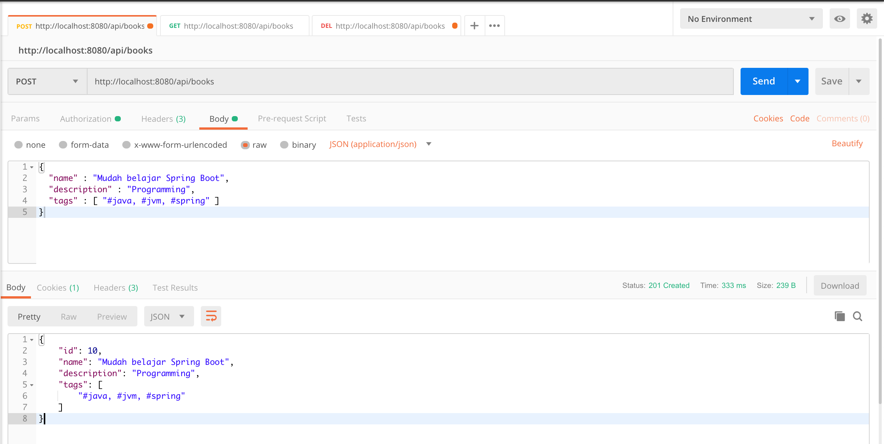
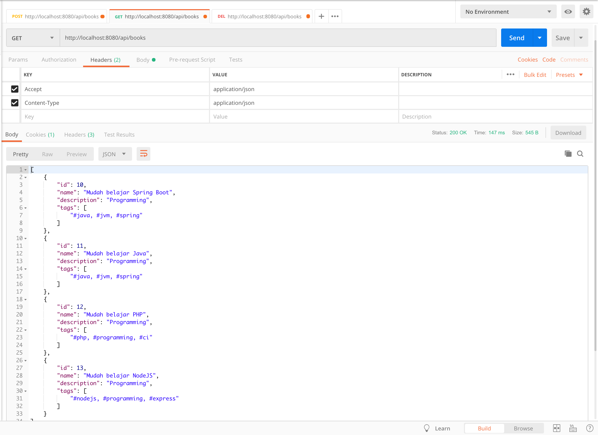
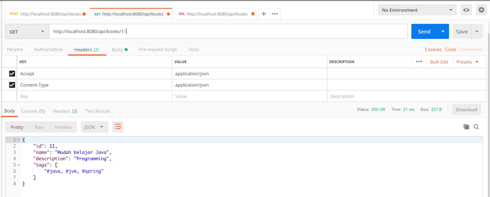
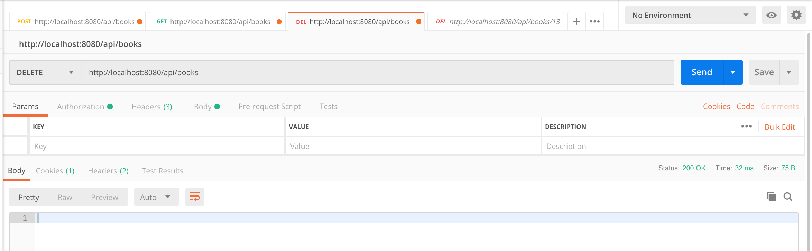

# Spring Boot REST API with PostgreSQL Deployment with Kubernetes and Minikube

REST API CRUD app and PostgreSQL which are provisioned and deployed using Kubernetes locally on Minikube

Disclaimer: This project is originally taken from [hendisantika/spring-boot-rest-api-postgresql](https://github.com/hendisantika/spring-boot-rest-api-postgresql).

## Prerequisite

1. Kubectl 1.25.x
2. Minikube 1.27.1

## How to use

Run `kubectl config current-context` and make sure that your current context is `minikube`

Start a local Kubernetes cluster
`minikube start`

Deploy all configs stored inside k8 folder to the local cluster  
`kubectl apply -f k8`

See the created pods
`kubectl get pods`

See pod detail
`kubectl describe pods <pod name>`

---

#### Plain REST API CRUD with Spring Boot and PostgreSQL.

Technology stack:

* Spring Boot;
* Spring Web;
* Spring Data;
* PostgreSQL database;
* Hibernate;
* Spring Security (as basic authentication).

##### Setup Environment Variables

You will need to setup some environment variables to run this application

```
BOOKS_API_DB_HOST=
BOOKS_API_DB_PORT=
BOOKS_API_DB_NAME=
BOOKS_API_DB_USERNAME=
BOOKS_API_DB_PASSWORD=
```

##### To run this application use:

`mvn clean spring-boot:run`

The view in the Postman:

Add new Book

`POST /api/books`

http://localhost:8080/api/books



Get All Books

`GET /api/books`

http://localhost:8080/api/books



Get Book By Id

`GET /api/books/{id}`

http://localhost:8080/api/books/{id}



Get Book By Name

`GET /api/books?name=name`

http://localhost:8080/api/books?name=name


Delete Book By Id

`DELETE /api/books/{id}`

http://localhost:8080/api/books/{id}


Delete All Books

`DELETE /api/books`

http://localhost:8080/api/books


