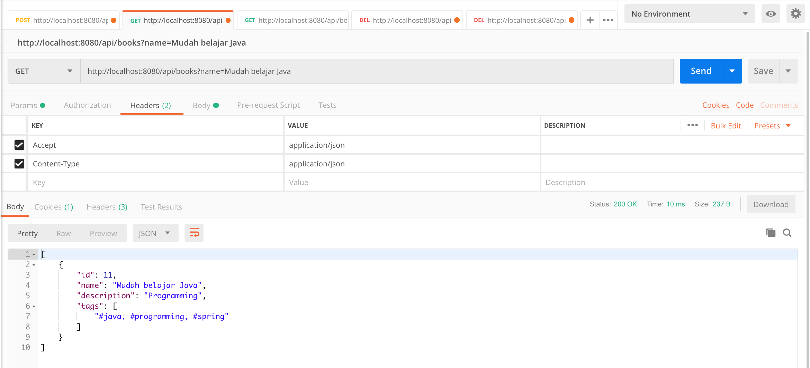

# Spring Boot REST API with PostgreSQL Deployment with Kubernetes and Minikube

REST API CRUD app and PostgreSQL which are provisioned and deployed using Kubernetes locally on Minikube

Disclaimer: This project is originally taken from [hendisantika/spring-boot-rest-api-postgresql](https://github.com/hendisantika/spring-boot-rest-api-postgresql).

## Prerequisite

1. Kubectl 1.25.x
2. Minikube 1.27.1

## How to use

Run `kubectl config current-context` and make sure that your current context is `minikube`

Start a local Kubernetes cluster  
`minikube start`

Enable Kubernetes ingress functionality on Minikube  
`minikube addons enable ingress`

Deploy all configs stored inside k8 folder to the local cluster  
`kubectl apply -f k8`

See the created pods and also the Ingress controller  
`kubectl get pods --all-namespaces`

Identify the Ingress Pod and describe it to retrieve the port  
`kubectl describe pod <ingress pod name> --namespace ingress-nginx | grep Ports`

Forward connections to a local port to a port on Ingress Controller
`kubectl port-forward <ingress pod name> 3000:80 --namespace ingress-nginx`

At this point, every time you visit port 3000 on your computer locally, the request is forwarded to port 80 on the Ingress controller Pod, then the Ingress pod will retrieve the Service to then connect the Pods and route traffic

---

#### Plain REST API CRUD with Spring Boot and PostgreSQL.

Technology stack:

* Spring Boot;
* Spring Web;
* Spring Data;
* PostgreSQL database;
* Hibernate;
* Spring Security (as basic authentication).

##### Setup Environment Variables

You will need to setup some environment variables to run this application

```
BOOKS_API_DB_HOST=
BOOKS_API_DB_PORT=
BOOKS_API_DB_NAME=
BOOKS_API_DB_USERNAME=
BOOKS_API_DB_PASSWORD=
```

##### To run this application use:

`mvn clean spring-boot:run`

The view in the Postman:

Add new Book

`POST /api/books`

http://localhost:3000/api/books


Get All Books

`GET /api/books`

http://localhost:3000/api/books


Get Book By Id

`GET /api/books/{id}`

http://localhost:3000/api/books/{id}


Get Book By Name

`GET /api/books?name=name`

http://localhost:3000/api/books?name=name



Delete Book By Id

`DELETE /api/books/{id}`

http://localhost:3000/api/books/{id}


Delete All Books

`DELETE /api/books`

http://localhost:3000/api/books


